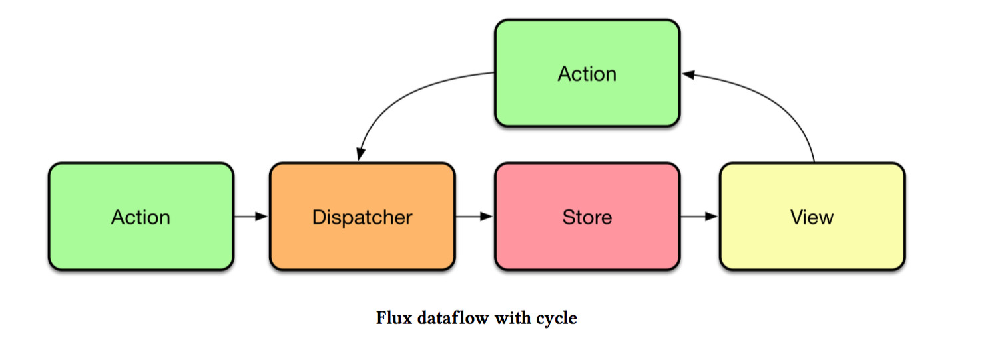

Notes
--

These are my notes on topics in [SurviveJS - React](https://github.com/survivejs/react) by [Juho Vepsäläinen](https://github.com/survivejs)

Flux
---

Action &#x2192; dispatcher &#x2192; store &#x2192; view

1. Actions - concrete operatons we can perform over out data &#x2192; NoteActions.create({task: 'Learn React'}). At simplest level actions just pass message to dispatcher as is
2. Dispatcher - as actions are trigger a dispatcher will get notified. The dispatcher deals with possible dependencies between stores. If a certain action needs to happen before another, dispatcher helps us achieve that
3. Stores - Once dispatcher deals with action, the stores listening to it get triggered. To continue above example, NoteStore gets notified and updates its internal state. Then the store notifies listeners of the new state
4. View - State changes, view gets updated

- bindActions maps each action from Action to a method in Store by name.
- Connect store with alt in export alt.createStore

Flux dataflow is unidirectional with a cyclical flow.

Advantages of Flux
-----
Application flexibility. With flux we can communicate with APIs outside of our views, then views can stay clean of logic and make app easier to understand.

This App uses Alt
-----
[Alt](alt.js.org) is a flexible, full-featured implementation designed with universal rendering in mind.

Alt deals with actions and stores. The dispatcher is hidden but you can still access it. Alt hides a lot of boilerplate and has special features that allow you to save and restore application state.

**Setting up an Alt Instance**

- Keeps track of actions and stores and persists communication
- In app/libs/alt.js we import and initiate alt in its own module so we can refer to it from everywhere else in our app
- Webpack caches modules so next time Alt is imported, it returns the same instance

localStorage
---
localStorage allows you to persist data in the browser vs sessionStorage that loses data when browser is closed.

Corner Case Failures:

1. Running out of memory in Internet Explorer (fails silently)
2. Failing in Safari private mode, explained in this [Stack Overflow](https://stackoverflow.com/questions/14555347/html5-localstorage-error-with-safari-quota-exceeded-err-dom-exception-22-an)

localStorage wrapper
-----
libs/storage. js:

- Using JSON.parse and JSON.stringify for serialization
- storage.get(k) &#x2192; key
- storage.set(k, v) &#x2192; key, value

**Using FinalStore from Alt**

- Alt built-in store called FinalStorage
- Every time any store changed, FinalStore knows about it
- Take snapshot of entire app state and push to localStorge every time FinalStorage changed
- alt.bootstrap allows us to sset state of all stores (doesn't emit events), must call before components are rendered then fetch data from localSTorage and invoke to populate stores

libs/persist.js:

- sets up FinalStore
- boostrapping to restore data
- snapshotting to save data
- debug as escape hatch so data won't get saved to localStorage
    - "The reasoning is that by doing this, you can set the flag (localStorage.setItem('debug', 'true')), hit localStorage.clear() and refresh the browser to get a clean slate." (SurviveJS, 90)
- trigger this logic at initialization: app/index.js
    - import alt, storage and persist from lib directory
    - persist(alt, storage, 'alt')

AltContainer
---
[AltContainer](http://alt.js.org/docs/components/altContainer/) wrapper simplifies connetion logic. With AltContainer we can bind data to immediate children.

For example, in components/App.jsx we inject notes property into Notes. This way we can set up and manage connections to multiple stores.

Component relationships
---

1. Lanes which hold a Lane &#x2192; Lane will render itself and Notes
2. Lanes container will render each Lane separately. Each Lane will render associated Notes
3. Note as wrapper component &#x2192; accepts Editable component and renders it. This allows us to put Drag and Drop functionality in Note and not duplicate logic into Editable

Drag & Drop
---

[React DnD](https://gaearon.github.io/react-dnd/), [HTML5 Drag and Drop based back-end](https://github.com/yahoo/react-dnd-touch-backend) npm packages. To use DragDropContext we need to provide a back-end.

1. Tell ReactDnD what can be dragged and where
2. constants/itemTypes tracks Note. ReactDnD uses constants to tell different draggable items apart

DragSource and DragTarget
-----

Marking a component as @DragSource means it can be dragged. connectDragSource prop wraps element at render return.

@DropTarget allows component to receive components annotated with @DragSource.

Back to Drag and Drop
-----

1. When we begin drag we need to capture Note id
2. When we hover over target we need Note id
3. Trigger onMove callback on hover
4. Lane to Lane uses [splice](https://developer.mozilla.org/en/docs/Web/JavaScript/Reference/Global_Objects/Array/splice). Splice out source note, splice into target lane
